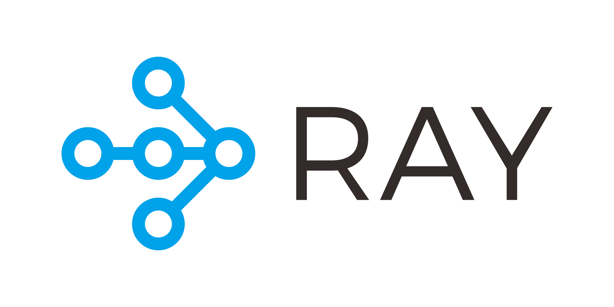

# Introduction to Ray for Distributed Applications 

© 2019-2022, Anyscale. All Rights Reserved

An introduction to [Ray](https://www.ray.io/), the system for scaling your Python and machine learning workloads from a laptop to a cluster. 
We'll start with a hands-on exploration of the core Ray API for distributed workloads, covering basic distributed Ray Core API patterns, and 
then move on to a quick introduction to Ray's native libraries:

 * Remote functions as tasks
 * Remote objects as futures
 * Remote classes as stateful actors
 * Quick introduction to Ray's native libraries

### Outline for this Tutorial Lesson 📖

Divided into three modules, each module will take about an hour, combined with lecture and followed by 
hands-on 👩‍💻 exercises in class.

### Module 1 
 * Lecture 20 mins
   * What is Ray and Why & Origins
   * Ray Component & Architecture
   * Ray Core API Decorators & Patterns
 * Notebooks & Exercises 
    * Ray Functions as distribtued stateless tasks
    * Ray Objects as Distributed future objects 
    * Ray Actors as distributed stateful services
   
### Module 2
   * Ray Actors Revisited: Understand a common pattern used in Ray native libraries 
   * Tour of the Ray APIs: a quick look at common APIs and some tricks & tips if new to Ray
   * Distributed multiprocessing.Pool: different strategies to scale Python with Ray
   * Notebooks & Exercises 

### Module 3
   * Brief Introduction to Ray Data: A gentle introduction to Ray Datasets
   * Brief Introduction to Ray AIR: A gentle 10-minute introduction to Ray AI Runitime (Ray AIR)
   
### Extra
   * Additional and supplemental material to peruse at leisure time.

### In this course, you will learn :
  * 👩‍💻Understand what the Ray ecosystem is and why to use it
  * 📖Learn about Ray Core basic APIs and Python APIs
  * 🧑‍💻Use Ray APIs to convert Python functions and classes into distributed stateless and stateful tasks
  * 🎛 Use Dashboard for inspection
  * 🧑‍💻Learn about the purpose of Ray native libraries and how to use them

### 🎓Prerequisite knowledge ###
**Level**: Beginners or new to Ray

 * Familiarity with Python 3.7+ and basic programming concepts: lists, comprehensions, decorators, functions, dictionaries, classes, loops, exceptional handling, etc
 * Laptop with at least 8-16GB Memory with latest Chrome browser
 * Prior knowledge of Jupyter notebooks helpful
 * Basic knowledge of machine learning concepts
 
Let's have 😜 fun with Ray! To start with this tutorial, [go here](ex_00_tutorial_overview.ipynb).
Help us improve training. Please fill out this [survey](https://bit.ly/ray-core-summit2022)

