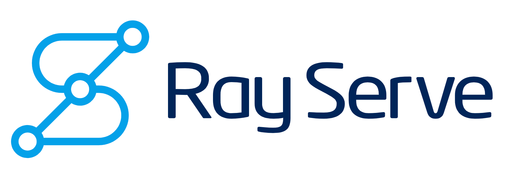

# Machine Learning Model Development & Deployment with Ray AIR 

© 2019-2022, Anyscale. All Rights Reserved

Divided into three modules, each module will take about an hour, combined with lecture and followed by 
hands-on 👩‍💻 exercises in class.

### Module 1 
#### Objective: Introduction of concepts, architecture, and Ray Serve APIs and integrations

 * Lecture 20 mins
   * What is Ray Serve & Why
   * Ray Serve Architecture & Components
   * Ray Serve Deployment Design Patterns
   * Ray Serve Integrations (MLflow, FastAPI, W & B)
   * What's new in Ray Serve 2.0
   * Introduction to Ray AIR for Machine Learning (Ray 2.0)
 * Notebooks & Exercises 
    * Ray Serve Model Serving Challenges
    * Ray Serve and MLflow Integration
    * Ray Serve Model Composition
   
### Module 2
#### Objective: Understand Deployment patterns and deployment graph APIs to build inference graphs
 * Notebooks & Exercises 
     * Ray Serve Inference Graphs
     * Ray Serve Model Composition revisited with inference graph APIs
     
### Module 3
#### Objective: Introduction to Ray AIR for end-to-end model development and deployment 
 * Notebooks & Exercises 

### In this course, you will learn :

* 👩 Understand Ray Serve architecture, components, and flow of requests across replicas
* 📖 Learn how to use Ray Serve APIs to create, access, and deploy your models and mechanisms to access model deployments via Python APIs and HTTP endpoints
* 🧑‍💻Implement common model deployment patterns for serving ML models using the inference graph API as a directed acyclic graph (DAG)
* 📈 Scale up/down individual components of an inference graph node, utilizing appropriate hardware resources (GPUs/CPUs) and replicas
* 🎛 Inspect load and deployments in a Ray dashboard
* ⚙️  Inttroduction of Ray AIR for end-to-end machine development/deployment

### 🎓Prerequisite knowledge ###
**Level**: Beginners or intermediate ML/DS/MLOps practitioners
 * Familiarity with Python 3.7+ and basic programming concepts: lists, comprehensions, decorators, functions, dictionaries, classes, loops, exceptional handling, etc
 * Laptop with at least 8-16GB Memory with latest Chrome browser
 * Prior knowledge of Jupyter notebooks helpful
 * Basic knowledge of machine learning concepts
 * Basic understanding of model serving or scoring

Let's have 😜 fun with Ray Serve! To start with this tutorial, go [here](ex_00_tutorial_overview.ipynb).

